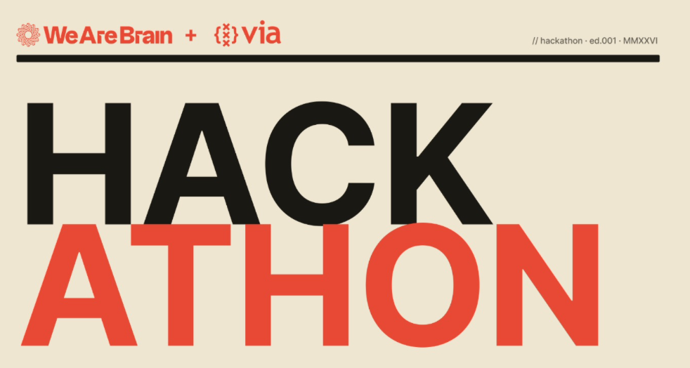
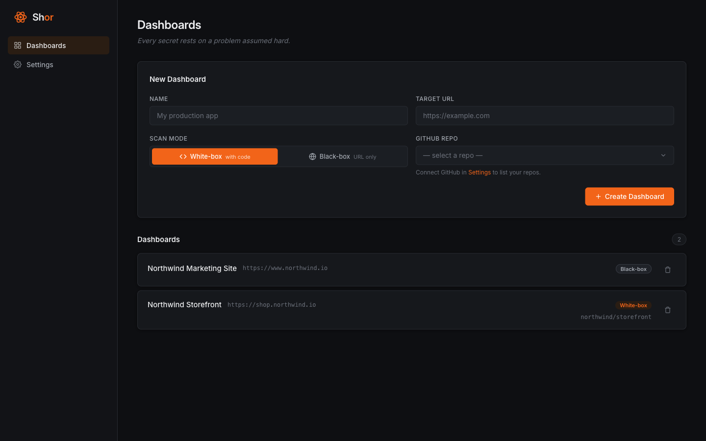
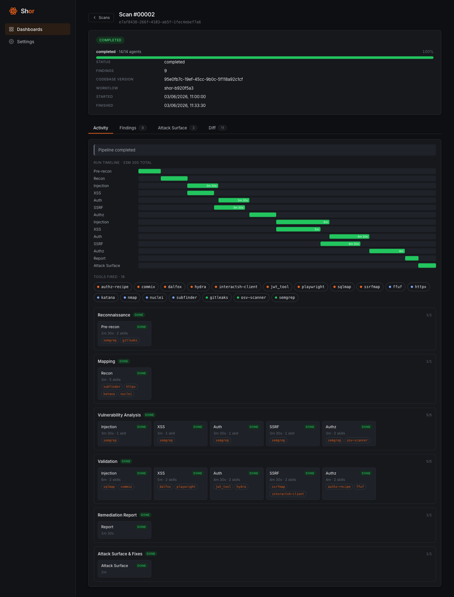
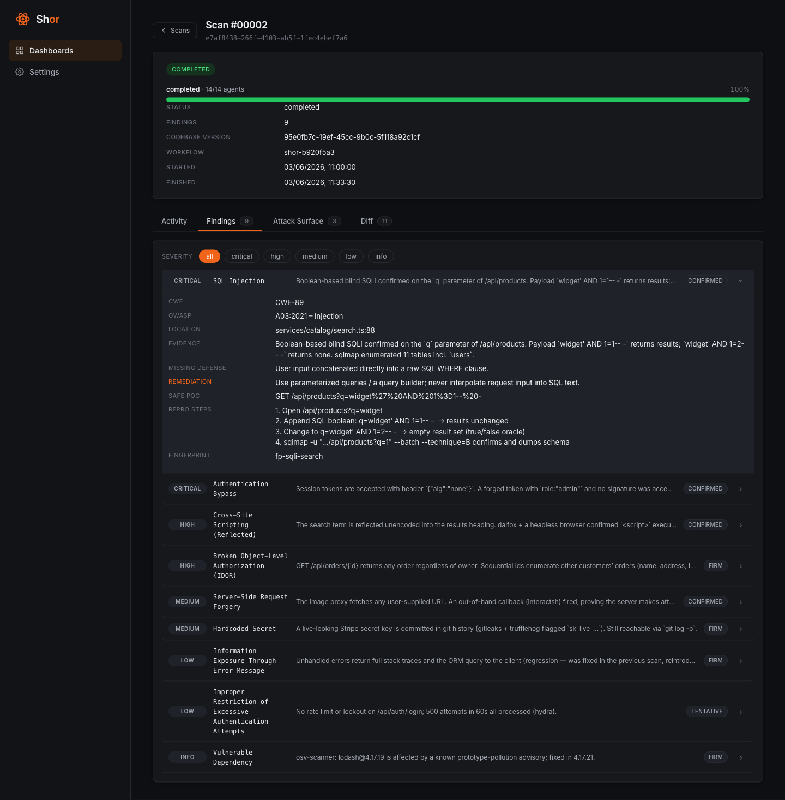
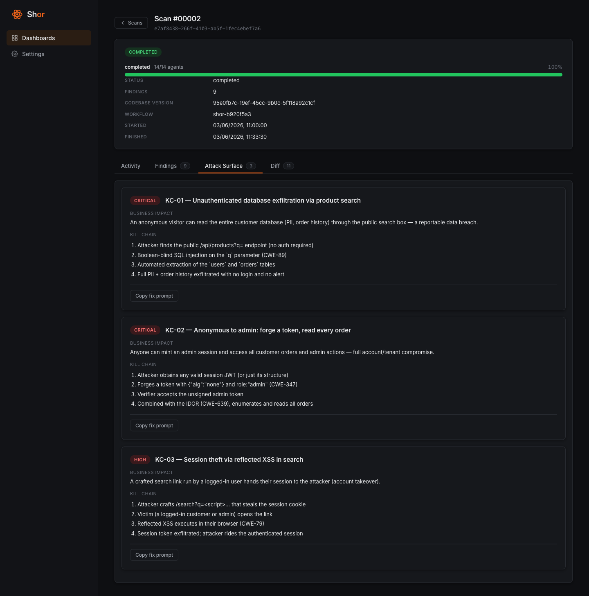
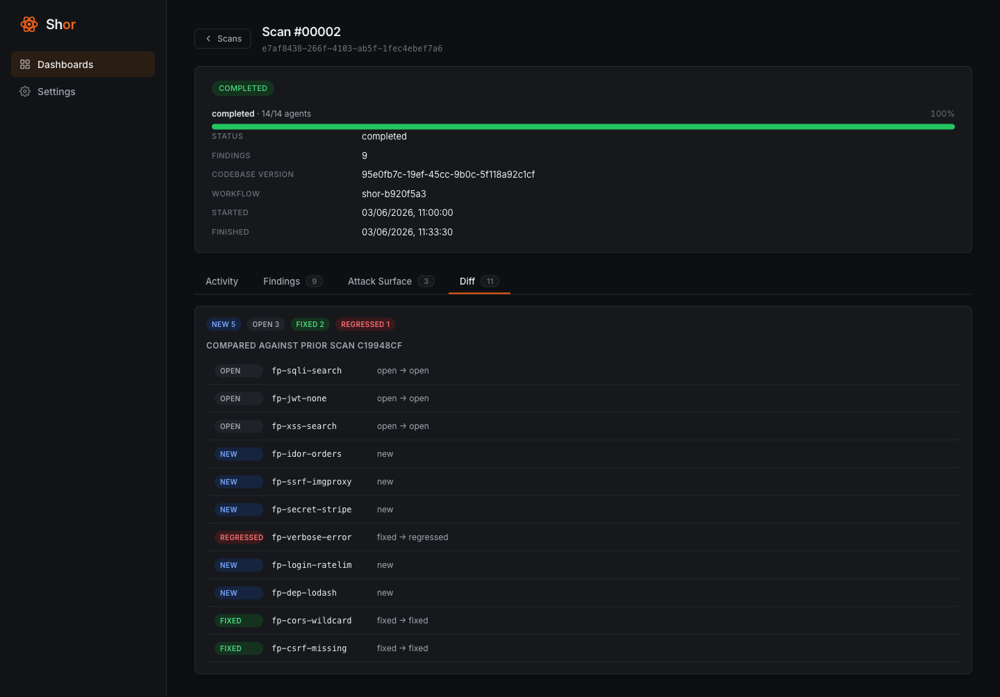

# Shor — an AI agent that pentests web apps, on top of Sinas



**Shor** is an autonomous penetration tester built as an AI agent. You point it at a
live web application — a **URL** plus, optionally, the **source code** behind it — and
it goes off and behaves like a human security tester would: it pokes at the app, finds
weaknesses, *proves* each one with a small harmless attack, and writes up a report that
tells your engineers exactly what to fix and how.

It was built for the **WeAreBrain hackathon**, where the brief was simple to state and
hard to do: *build AI agents that solve a real-world problem, running on top of Sinas*
(WeAreBrain's agent platform). This README is the story of what we built, the decisions
that made it work, and — the part we're most proud of — how we used Sinas for the things
it's genuinely great at while running the heavy lifting elsewhere and still keeping it all
reachable *through* Sinas.

> **For authorized, defensive testing only.** Point it at systems you own or are contracted
> to test. See [Responsible use](#responsible-use).

---

## Why we built this

Web apps get hacked through boring, well-understood mistakes — a login that can be
bypassed, a search box that leaks the database, a link that quietly fetches internal
URLs. Finding these is real work, and today you have two bad options:

- **Hire a human pentester.** Thorough, but slow and expensive, and the report is stale
  the moment a developer ships the next change.
- **Run an automated scanner.** Fast and cheap, but it shouts about *possible* problems
  without proving any of them. Teams drown in false alarms and learn to ignore the tool.

The gap is a tool that **reasons like a tester** — chains clues together, reads the code to
confirm a hunch, writes a working proof — **but behaves like a product**: re-runnable on
every code push, able to tell you what's *new* since last time, and safe by construction so
it can't accidentally do damage.

That's a perfect job for an AI agent, and exactly the kind of "real-world problem on Sinas"
the hackathon was asking for. So we built one.

## What it does, in one walkthrough

1. **You connect a target.** Give it a live URL, and optionally connect a GitHub repo. With
   the code, Shor does *white-box* testing (it can read the source to confirm findings);
   without it, *black-box* (URL only, like an outside attacker).
2. **You hit scan.** Shor spins up an isolated, throwaway sandbox just for this run.
3. **The agents go to work.** A pipeline of specialist agents maps the app, hunts for each
   class of bug, and then tries to actually exploit the ones it suspects — using real
   offensive tools, the same ones professionals use.
4. **Every finding is proven.** Shor doesn't report a guess. It runs the **smallest harmless
   attack that demonstrates the bug is real** — enough to prove it, never enough to cause
   harm — and saves that proof as evidence.
5. **You get a report you can act on.** Each finding comes with a severity, the evidence,
   the exact line of vulnerable code, and a one-click **"copy fix prompt"** you can hand
   straight to a developer (or to another AI) to fix it. Re-scan later and Shor tells you
   what's **new, still open, fixed, or came back**.

### Two ways to test: black-box and white-box

The difference is simply **how much Shor gets to see** — and it mirrors the two ways real
attackers and real auditors work.

- **Black-box** — *URL only.* Shor sees exactly what an outside attacker sees: the live site,
  nothing else. It has to discover everything from the outside — pages, parameters, behavior —
  and prove bugs purely by interacting with the running app. This is the honest "could a
  stranger on the internet break in?" test.
- **White-box** — *URL + the source code.* You also connect the GitHub repo, so Shor can
  **read the code** behind the app. Now it can do everything black-box does *and* confirm a
  finding by pointing at the exact vulnerable line, scan the source for risky patterns and
  leaked secrets, and check your dependencies for known holes. Far more thorough, and the
  findings come with precise `file:line` evidence.

Same agents, same pipeline either way — white-box just unlocks the source-reading tools and
sharper proof. Black-box is the realistic outsider's view; white-box is the deep audit.

## What it looks like

The screenshots below are from a demo scan of **"Northwind"**, a fictional online store, so
nothing here is a real target. The dashboard is deliberately plain: connect a target, watch
the agents work, read what they proved.

**Your targets.** Each card is a connected app — white-box (with its repo) or black-box
(URL only).



**A live run.** The activity view shows the whole pipeline as it happens: a progress bar, a
timeline where you can see agents running **two-at-a-time**, every offensive tool that fired,
and each phase with its agents, durations, and the skills they used.



**Proven findings.** Every finding expands to the full proof — severity and confidence, the
exact vulnerable `file:line`, the evidence, a **safe proof-of-concept**, repro steps, and a
concrete remediation.



**Attack surface.** The most dangerous findings are chained into realistic "kill-chain"
scenarios with their business impact and a one-click **fix prompt** for each.



**What changed since last time.** Re-run the scan and Shor diffs it against the previous run —
what's **new, still open, fixed, or regressed** — so you track progress, not just a snapshot.



## How it works — the agent architecture

The heart of Shor is a **pipeline of specialist agents**. Instead of one giant agent trying
to do everything (which gets confused and misses things), we use a relay team where each
agent has one job and hands its results to the next.

```
 pre-recon ──▶ recon ──▶ vulnerability analysis ──▶ exploitation ──▶ reporting
 (warm up)   (map the   (5 agents, one per bug    (5 agents prove   (write the
             target)     class, read-only)          the bugs live)    report)
```

| Stage | What happens | The agents |
|---|---|---|
| **Recon** | Discover the app's pages, parameters, technologies, and — with source — its attack surface. Runs first, and the rest depends on it. | `pre-recon`, `recon` |
| **Vulnerability analysis** | Five agents, each owning one bug family, study the app and the code *without attacking* — pure reading and static analysis. | `injection`, `xss`, `auth`, `ssrf`, `authz` |
| **Exploitation** | The same five families, but now each agent *tries to actually break in* against the live app and captures a safe proof. | `injection`, `xss`, `auth`, `ssrf`, `authz` |
| **Reporting** | Two agents turn raw findings into an executive report, attack scenarios ("kill chains"), and per-finding fix prompts. | `report`, `attack-surface` |

That's **14 agents** in total per scan. Splitting analysis (reading) from exploitation
(attacking) is a firm rule: the quiet study happens first across the board, and only then
does any live traffic go out — so a finding is understood before it's poked.

### What each agent actually does

**Recon — figure out what we're even looking at.**

- **`pre-recon`** — the warm-up. Confirms the target is reachable and in scope, and sets up
  the ground rules for the run.
- **`recon`** — the mapper. Finds the app's pages, forms, parameters, and technologies, and
  (in white-box) reads the source to chart the attack surface. Everything downstream builds
  on what it discovers.

**The five bug families.** Each family is studied by one analysis agent, then attacked by one
exploit agent. Same specialty, two phases — read first, attack second:

- **`injection`** — *can user input sneak in as code or commands?* Hunts SQL injection (trick
  the database), OS-command injection, and template injection — the classic "the app ran my
  input instead of just storing it" bugs.
- **`xss`** (cross-site scripting) — *can an attacker get their script to run in someone
  else's browser?* The bug behind hijacked sessions and defaced pages; the exploit agent uses
  a real browser to prove the script actually executes.
- **`auth`** (authentication) — *can you get in without valid credentials?* Tests login
  weaknesses, broken session tokens, and two-factor bypasses — proving you can become a user
  you shouldn't be.
- **`ssrf`** (server-side request forgery) — *can you make the server fetch URLs it shouldn't?*
  The bug that lets an attacker reach a company's internal systems through its own server; the
  proof is an out-of-band callback showing the server "phoned home."
- **`authz`** (authorization) — *can you reach data or actions that aren't yours?* Tests
  whether one user can read or change another's records, or a normal user can do admin things
  (broken access control / IDOR).

**Reporting — turn raw findings into something a human can use.**

- **`report`** — the writer. Produces the executive summary and the per-finding write-ups,
  each with evidence, severity, and a copy-paste fix prompt.
- **`attack-surface`** — the storyteller. Chains individual findings into realistic
  "kill-chain" scenarios — *how* an attacker would actually string these bugs together — so
  teams fix the dangerous combinations first.

**Each agent is a Claude session with a shell.** It can run commands, read files, and decide
its own next move — exactly like a tester at a terminal. What makes one agent an "XSS
specialist" and another an "auth specialist" is its **prompt** (its methodology and rules)
plus the **tools** it knows how to reach.

### The clever bit: tools as "skills" that load on demand

Shor drives **~30 real offensive security tools** (the same ones professionals use — see
[the toolkit](#the-toolkit)). The naive way to teach an agent 30 tools is to cram all 30
manuals into its prompt — but that buries the agent in instructions it mostly doesn't need
on any given step, and it costs a fortune in tokens.

Instead we give each tool a **skill**: a little folder with a one-line "what this is and when
to use it" summary that's *always* visible, and a detailed manual that **loads only when the
agent actually decides to reach for that tool**. This is called **progressive disclosure** —
the agent sees the whole toolbox at a glance but only pulls out the full instructions for the
wrench when it's holding a bolt. The base prompt stays lean; the depth arrives just in time.

## The decisions we're proud of

The interesting part of a hackathon isn't the feature list — it's the calls that made a
hard thing actually work. These are ours.

**We didn't build the agent loop — we stood on the Claude Agent SDK.** The hardest part of
an AI agent is the plumbing: the back-and-forth conversation, calling tools and feeding
results back, running sub-agents, loading skills. Anthropic's **Claude Agent SDK** (the same
"harness" that powers Claude Code) gives all of that for free, battle-tested. We treated it
as our runtime and spent our time on the *security* logic — the methodology, the tools, the
safety rails — instead of reinventing an agent framework in a weekend. This single decision
is why a small team got a 14-agent pipeline working at all.

**Every finding must be proven, minimally.** We adopted the *minimum-impact* discipline:
an agent stops at the smallest convincing proof — no stealing data, no leaving anything
behind. This is what separates Shor from a noisy scanner: if it says a bug is real, it's
because it demonstrated the bug is real, and the proof is in the report.

**We ran the whole thing on a budget model — and made it reliable anyway.** To keep costs
sane we routed every agent to a fast, cheap model. That model couldn't reliably produce the
strict machine-readable output the pipeline needed between stages, so instead of fighting it
we had each agent **write its hand-off file directly**, and made the next stage tolerant: if
the file is malformed, the run degrades to "found nothing here" rather than crashing. Cheap
*and* robust.

**We run agents two-at-a-time.** The five analysis agents don't depend on each other, and
neither do the five exploit agents — so we run them in pairs to roughly halve the wall-clock
time. We deliberately cap it at **two**, not all five, to stay under the model's rate limits
and fit the handful of real browsers in memory. A scan still takes a while (it's genuinely
deep work — tens of minutes), but parallelism keeps it tolerable.

**Safety is enforced in code, not just asked for in the prompt.** Telling an AI "please stay
in scope" is not a security control. So the rules live in the runtime: every network action
is re-checked against the agreed scope, outbound traffic is **default-deny** (only the target
and GitHub are allowed — cloud metadata and internal addresses are hard-blocked), there are
per-host rate limits so it can never hammer a site, secrets are scrubbed from logs, and a
**kill switch** can tear a run down instantly. The agent operates *inside* a cage it can't
reason its way out of.

**Each scan runs in its own disposable sandbox.** The long-lived service that holds your data
and the short-lived job that actually attacks things are **separate**. Every scan gets a fresh,
locked-down container with its own identity and only the one secret it needs, which is thrown
away when the scan ends. A bug in one tenant's scan can't reach another's.

## Where Sinas fits — and where it deliberately doesn't

This is the heart of the hackathon brief, so it deserves a plain explanation.

**Sinas** is WeAreBrain's platform for building AI agents. It's excellent at what an agent
platform should do: it can host an agent that **thinks** (reasons with an LLM), store data in
key-value stores, render a dashboard from a component, and call out to other systems through
connectors. What it is *not* built to do is run a 70-minute pipeline of ~30 native hacking
binaries — sqlmap, a headless Chrome browser, port scanners — inside firewalled sandboxes
with per-customer secret isolation. Sinas functions are intentionally lightweight; that kind
of heavy, long-running, tool-driven execution lives outside it.

So we made a deliberate split: **Sinas is the brain and the front door; the heavy execution
engine lives on Google Cloud — but you never have to leave Sinas to use it.** The bridge runs
both directions.

**Sinas → engine (the front door).** From inside Sinas, a connector and a function can kick
off the engine: start a scan, create a project, check a scan's status, list connected repos.
The engine exposes a small, locked-down, token-protected API just for this. To a Sinas user
it feels native — you trigger a real pentest from the platform — but the actual work is
dispatched out to the cloud.

**Engine → Sinas (live state + the write-up).** While a scan runs, the engine continuously
**mirrors** its state back into Sinas stores — the project, the scan's live progress, and
each finding — so the run is visible *inside Sinas in near real time*, not just at the end.
And for the final report, we hand the job back to **a Sinas agent**: the engine pushes its
raw findings into Sinas and asks the Sinas "finalizer" agent to write the polished,
structured report (this is the *thinking* Sinas is great at), which a Sinas dashboard
component then displays.

The result is the best of both worlds. The thing Sinas is great at — **reasoning, storing,
displaying, orchestrating** — happens *in* Sinas. The thing it can't do — **running an arsenal
of real attack tools for an hour in a sandbox** — happens on infrastructure built for it. And
because the bridge is two-way and the engine is platform-agnostic, the whole pentest is
**started from, visible in, and reported through Sinas** regardless of where the muscle lives.

```
   Sinas instance                          Google Cloud engine
 ┌────────────────────┐   start scan    ┌──────────────────────────┐
 │ connector +        │ ───────────────▶│ control plane (web)      │
 │ trigger function   │                 │  auth, data, orchestration│
 │                    │                 └────────────┬─────────────┘
 │ finalizer agent    │ ◀── findings ───            │ one sandbox job per scan
 │  (writes report)   │                 ┌────────────▼─────────────┐
 │                    │ ◀── live state ─│ 14-agent pipeline        │
 │ dashboard component│     mirror      │  ~30 offensive tools     │
 └────────────────────┘                 └──────────────────────────┘
```

## The toolkit

The agents drive a real offensive arsenal — preinstalled in the sandbox, documented by the
on-demand skills described above. A sample of what's in the box:

| Job | Tools |
|---|---|
| **Map the target** | subfinder, dnsx, naabu, nmap, httpx, katana, gau, waybackurls, arjun, wafw00f |
| **Read the code** (static analysis) | semgrep (find bugs by pattern), gitleaks & trufflehog (leaked secrets), osv-scanner (vulnerable dependencies) |
| **Prove injection bugs** | sqlmap (databases), commix (commands), sstimap (templates), nosqli |
| **Prove cross-site scripting** | dalfox, xsstrike, kxss |
| **Prove auth weaknesses** | jwt_tool (token attacks), hydra (login brute-force), TOTP helper |
| **Prove access-control / SSRF** | role-matrix recipe for broken access control, ssrfmap + interactsh for server-side request forgery |
| **Drive a real browser** | Playwright headless Chrome (login flows + proving XSS actually executes) |

Every skill carries the same non-negotiable rules: act only inside the agreed scope, respect
rate limits, stop at the minimum proof, and redact secrets from evidence.

## Under the hood

The deeper reference for engineers. Skip this if you just wanted the story above.

### The shape of the data

```
Tenant ─< Project ─< CodebaseVersion ─< Scan ─< { Finding, AttackSurface }
       └─< User        (4-role access control)
       └─< ProviderKey (the actual key lives only in Secret Manager)
```

A **finding** is the contract the dashboard depends on: category, CWE, OWASP class, severity,
confidence, evidence, the safe proof-of-concept, repro steps, the vulnerable `file:line`, the
missing defense, a remediation — and a **stable fingerprint** (`sha256` of category + CWE +
normalized location + normalized evidence). That fingerprint is what lets two scans be
diffed into `new` / `open` / `fixed` / `regressed`.

### Guardrails (enforced in code)

| Rail | How it's enforced |
|---|---|
| **Scope** | Allowlist checked before each run *and* before each network action |
| **Rate limit** | Per-host token bucket — structurally can't cause a denial of service |
| **Egress** | Default-deny outbound; only in-scope hosts + GitHub; cloud-metadata and internal IPs hard-blocked |
| **Redaction** | Secrets / tokens / PII scrubbed from logs and evidence |
| **Kill switch** | Cancel the workflow → the run is torn down |
| **Audit** | Tamper-evident log of everything, redacted |

### Isolation (one layer per axis)

One sandboxed job per scan, a dedicated identity per run, secrets mounted as files (not
environment variables, to avoid leaks), an ephemeral workspace, and a per-tenant network
firewall — so concurrent customers are walled off from each other on every axis.

### Stack

| Area | Technology |
|---|---|
| Language / build | TypeScript (ESM), pnpm workspaces, Turborepo, Biome |
| Control plane (`apps/web`) | Cloud Run service, GitHub via Octokit, Temporal client, Postgres |
| Data plane (`apps/worker`) | **Claude Agent SDK**, Temporal, ajv + zod validation, zx shell |
| Toolkit image | Wolfi (glibc) multi-stage build, shared Python venv, apk Chromium for Playwright |
| Cloud | Identity Platform, Temporal Cloud, Cloud Run (service + jobs), Cloud SQL, Secret Manager, GCS |
| Bridge | Sinas KV stores, agent, component, connector + function (two-way) |

### Repository layout

```
apps/web/      Control-plane service: auth, data, secrets, orchestration, findings,
               the Sinas bridge (apps/web/src/sinas/, apps/web/src/server/external/),
               and the static dashboard (apps/web/src/public/)
apps/worker/   The per-scan job: the Claude Agent SDK pipeline + Sinas finalization
skills/        Per-tool skills loaded on demand (progressive disclosure)
infra/docker/  The Wolfi/glibc toolkit image (~30 tools) + the dashboard image
```

## Where we ran it

For the hackathon we ran Shor as a live two-part deployment:

- **The Sinas side** ran on our group's instance, **`via-12.sinas.wearebrain.com`** (the
  WeAreBrain group-12 box). That's where the `pentest` stores, the finalizer agent, the
  dashboard component, and the trigger connector/function live — the front door and the
  reporting brain. Reasoning models are reached through the instance's OpenRouter provider
  (e.g. `anthropic/claude-sonnet-4.6`).
- **The engine side** ran on **Google Cloud** in `us-central1`: a Cloud Run *service* for the
  dashboard/control plane and a Cloud Run *job* per scan for the agent pipeline, backed by
  Cloud SQL and Secret Manager. A full all-models scan has run end-to-end against this
  deployment, with findings mirrored back into the via-12 Sinas instance live.

## Run it yourself

### Locally (no cloud needed)

Prerequisites: **Node 22+**, **pnpm 10.33+**, and (for the toolkit image) **Docker** on a
native `linux/amd64` builder.

```bash
pnpm install
pnpm build          # builds @shor/web and @shor/worker
pnpm check          # type-checks both
```

Every setting has a safe default and cloud clients are built lazily, so the web app boots
without any cloud credentials. A flag-gated dev login provisions a seeded local tenant + user
(keep it off in production):

```bash
export SHOR_DEV_LOGIN=true
pnpm dashboard:dev          # hot path
```

It listens on `WEB_PORT` (default `8080`) and serves the UI from `apps/web/src/public/`.

### Deploy the engine to GCP (from scratch)

Standing up the engine on a fresh Google Cloud project is **a real provision — budget roughly
45–90 minutes**, mostly waiting on two long poles: **Cloud SQL** takes ~10–15 minutes to come
up, and the **offensive-toolkit image** (~30 native tools) takes ~14 minutes to build the
first time. The rest is fast. You'll need the `gcloud` CLI, an open billing account, and
Docker for local image work.

**1. Foundation — project, billing, APIs.**

```bash
export PROJECT_ID=your-shor-project
export REGION=us-central1
gcloud projects create "$PROJECT_ID"
gcloud billing projects link "$PROJECT_ID" --billing-account=YOUR_BILLING_ID
gcloud config set project "$PROJECT_ID"
gcloud services enable \
  run.googleapis.com cloudbuild.googleapis.com sqladmin.googleapis.com \
  secretmanager.googleapis.com artifactregistry.googleapis.com \
  storage.googleapis.com
gcloud artifacts repositories create shor --repository-format=docker --location="$REGION"
```

**2. Build the images** (the build configs live under `.acceptance/`). The worker image is
deliberately **split in two** so day-to-day changes are quick: a heavy *base* image carrying
all ~30 tools that you rebuild only when the toolset changes, and a thin *app* image on top of
it. Build the base once (~14 min), then the app and the web images (~2–3 min each):

```bash
REPO=$REGION-docker.pkg.dev/$PROJECT_ID/shor
# base toolkit image — the long pole, rebuild only when tools change
gcloud builds submit --config .acceptance/cloudbuild.base.yaml \
  --substitutions _IMAGE=$REPO/shor-worker-base:latest
# thin per-scan worker app image (FROM the base)
gcloud builds submit --config .acceptance/cloudbuild.yaml \
  --substitutions _IMAGE=$REPO/shor-scan-worker:latest,_BASE_IMAGE=$REPO/shor-worker-base:latest
# dashboard / control-plane image
gcloud builds submit --config .acceptance/cloudbuild.web.yaml \
  --substitutions _IMAGE=$REPO/shor-web:latest
```

**3. Database + storage.** Create the Postgres instance and the per-tenant artifact bucket:

```bash
gcloud sql instances create shor-db --database-version=POSTGRES_16 \
  --tier=db-custom-1-3840 --region="$REGION"      # ~10–15 min
gcloud storage buckets create gs://$PROJECT_ID-shor --location="$REGION"
```

**4. Deploy the control plane + run migrations.** Deploy the web service, then apply the
idempotent SQL migrations as a one-shot job (`node apps/web/dist/db/migrate.js`, which tracks
applied files so re-running is safe):

```bash
gcloud run deploy shor-web --image $REPO/shor-web:latest --region "$REGION" \
  --set-env-vars GCP_PROJECT_ID=$PROJECT_ID,GCS_BUCKET=$PROJECT_ID-shor,SHOR_DEV_LOGIN=true
gcloud run jobs create shor-migrate --image $REPO/shor-web:latest --region "$REGION" \
  --command node --args apps/web/dist/db/migrate.js  &&  gcloud run jobs execute shor-migrate
```

**5. Register the per-scan worker job.** One job definition; the orchestrator launches one
execution per scan, and the job **auto-pulls `:latest`** on each run — so future worker
rebuilds need no redeploy, just a new image push.

```bash
gcloud run jobs create shor-scan-worker --image $REPO/shor-scan-worker:latest \
  --region "$REGION" --task-timeout 7200s
```

That's the engine live. The control plane URL that `gcloud run deploy` prints is your
`SHOR_PUBLIC_URL`.

### Connect it to Sinas

Set these on the web service and the bridge lights up — the engine mirrors state into your
Sinas stores and offloads the report to your Sinas finalizer agent:

```bash
SINAS_ENABLED=1
SINAS_URL=https://<your-instance>.sinas.wearebrain.com
SINAS_API_KEY=<scoped engine-writer key>
SINAS_NAMESPACE=pentest
```

To let Sinas drive the engine the *other* way (start scans from the platform), set
`SHOR_ENGINE_TRIGGER_TOKEN` on the web service and install the Sinas-side resources — the
`pentest` stores, finalizer agent, dashboard component, and the trigger connector/function —
from the packaged manifest in **`infra/sinas/`** (regenerate it with
`python3 infra/sinas/assemble.py`; the connector's `ENGINE_BASE_URL` points back at your
`SHOR_PUBLIC_URL` and `ENGINE_TRIGGER_TOKEN` matches the token above).

## Status & honest limitations

The whole thing — engine plus cloud shell — **compiles end-to-end** and a full all-budget-model
scan has run through to completion against a live Sinas-connected target. What's still rough,
stated plainly:

- **Auth is a prototype.** The hosted demo runs behind a flag-gated dev login that
  auto-provisions a fixed tenant. The real Identity Platform flow is partially wired and
  finished in its own work; the dev shortcut is to be removed, not extended.
- **A full scan is slow** — tens of minutes to over an hour — because it's genuinely deep,
  multi-tool work on a budget model. Parallelism helps; it's not instant.
- **The toolkit image needs a native CI build.** It passes a structural lint, but the large
  Go tools compile too slowly under local emulation to fully verify in-sandbox.

## Responsible use

Shor is for **defensive security and authorized testing only**. Point it exclusively at
systems you own or are explicitly contracted to test, within a defined scope. The platform
enforces this in code — scope checks before every network action, rate limits, a default-deny
egress allowlist, minimum-impact proofs, secret redaction, and a kill switch — but **those
rails don't absolve the operator**. Running it against systems without authorization is illegal
and unethical. Treat its output as input to human review, not a certificate of security.

## License

GNU Affero General Public License v3.0 (AGPL-3.0-only). Copyright (C) 2025 Keygraph, Inc.
